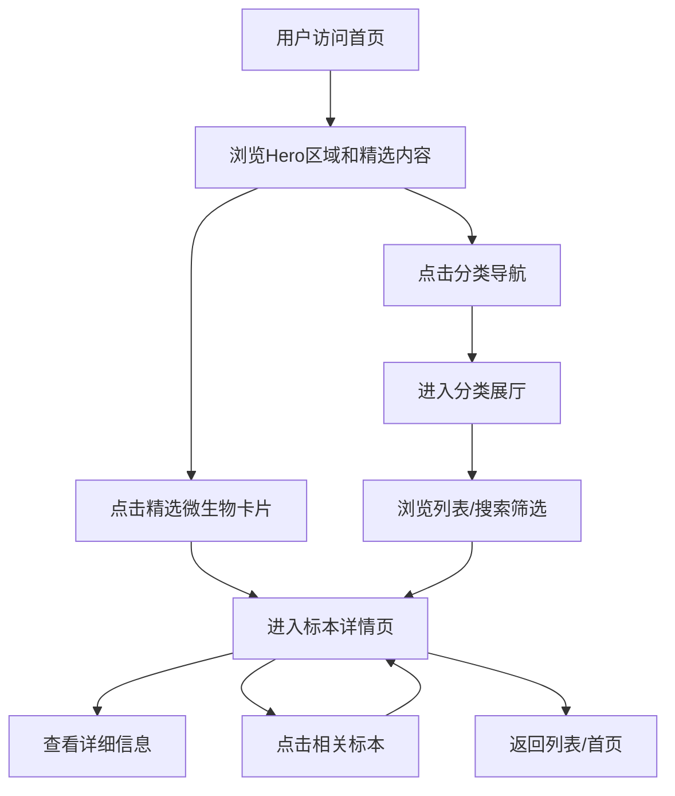

## 1. 产品概述

"微生物文明馆"是一个沉浸式微生物科普Web应用，以博物馆展览的形式向用户展示微观世界中的生命多样性。用户可以浏览细菌、真菌、病毒、古菌等不同微生物分类，了解它们的形态特征、生存环境和科学意义。

- **目标用户**：生物爱好者、学生、科研工作者及对微观生命世界充满好奇的大众
- **产品价值**：将看不见的微生物世界可视化、艺术化，让科学知识变得生动有趣

## 2. 核心功能

### 2.1 用户角色

| 角色 | 注册方式 | 核心权限 |
|------|----------|----------|
| 访客用户 | 无需注册 | 浏览所有微生物信息、分类筛选、搜索、查看详情 |

### 2.2 功能模块

1. **首页大厅**：沉浸式Hero区域、分类导航、精选微生物展示、数据统计
2. **分类展厅**：细菌/真菌/病毒/古菌四大分类浏览、卡片式展示、筛选排序
3. **标本详情页**：微生物大图、基本信息、生存环境、详细介绍、相关推荐

### 2.3 页面详情

| 页面名称 | 模块名称 | 功能描述 |
|----------|----------|----------|
| 首页大厅 | Hero区域 | 全屏沉浸式背景、动态粒子效果、主标题动画、入口按钮 |
| 首页大厅 | 分类导航 | 四大分类卡片，悬浮有光效，点击跳转对应分类 |
| 首页大厅 | 精选标本 | 微生物卡片网格展示，滚动动画，显示名称/分类/缩略图 |
| 首页大厅 | 数据统计 | 展示微生物总数、分类数量等数据，数字滚动动画 |
| 分类展厅 | 分类标题区 | 分类名称、简介、代表性视觉元素 |
| 分类展厅 | 筛选工具栏 | 按名称搜索、多种排序方式 |
| 分类展厅 | 微生物卡片列表 | 响应式网格布局、卡片悬浮动效、图片+名称+简介 |
| 标本详情页 | 主视觉区 | 大图展示、名称、分类标签、标志性视觉效果 |
| 标本详情页 | 信息面板 | 学名、分类、生存环境、发现时间等关键信息 |
| 标本详情页 | 详细介绍 | 富文本描述、分章节展示微生物特性 |
| 标本详情页 | 相关标本 | 同分类其他微生物推荐卡片 |

## 3. 核心流程

用户访问网站 → 浏览首页大厅 → 通过分类导航或精选卡片进入分类展厅 → 浏览微生物列表 → 点击感兴趣的微生物卡片进入详情页 → 查看详细信息或返回继续探索

## 4. 用户界面设计

### 4.1 设计风格

**设计理念：微观幻境 · 生物科技美学**

将显微镜下的微观世界升华为艺术，营造一个既科学严谨又充满奇幻色彩的数字博物馆。

- **主色调**：深海墨绿 `#0a1f1c`（背景）+ 生物荧光青 `#00ffc8`（主强调色）
- **辅助色**：孢子橙 `#ff7b29`、真菌紫 `#9b59b6`、病毒红 `#e74c3c`、古菌金 `#f1c40f`
- **中性色**：深灰 `#1a2a28`、中灰 `#2d4a46`、浅白 `#e8f5f2`
- **字体选择**：
  - 标题：**Cormorant Garamond**（优雅衬线，体现博物馆的学术与古典气质）
  - 正文：**JetBrains Mono**（等宽字体，科技感与可读性兼具）
- **按钮风格**：圆角胶囊形，边框发光效果，悬浮时有呼吸光效
- **布局风格**：不规则网格布局，卡片重叠错落，大面积留白营造呼吸感
- **视觉元素**：微生物轮廓线描图、荧光粒子效果、有机曲线分割、玻璃拟态面板
- **图标风格**：Lucide图标库，统一线性风格，荧光色填充

### 4.2 页面设计概览

| 页面名称 | 模块名称 | UI元素 |
|----------|----------|--------|
| 首页大厅 | Hero区域 | 全屏深色背景 + 动态漂浮微生物粒子 + 大标题渐入动画 + 荧光按钮 |
| 首页大厅 | 分类导航 | 四张渐变玻璃卡片（不同分类不同色调）+ 悬浮光效 + 分类图标 |
| 首页大厅 | 精选标本 | 响应式网格 + 卡片图片缩放动效 + 名称荧光下划线 |
| 分类展厅 | 分类标题区 | 大幅背景图 + 分类代表色光效 + 介绍文字 |
| 分类展厅 | 微生物卡片 | 圆角卡片 + 图片上移悬浮 + 分类标签胶囊 |
| 标本详情页 | 主视觉区 | 圆形大图像显微镜视野 + 信息层叠布局 |
| 标本详情页 | 信息面板 | 玻璃拟态卡片 + 信息键值对网格布局 |

### 4.3 响应式设计

- **设计原则**：Desktop-first，移动端自适应
- **断点设置**：Desktop (>1024px)、Tablet (768-1024px)、Mobile (<768px)
- **移动端优化**：单列布局、触摸友好的按钮尺寸、简化动画效果

### 4.4 动效设计指导

- **页面入场**：元素从上至下/两侧渐入，带轻微位移和透明度变化，stagger延迟
- **卡片悬浮**：图片缓慢放大（scale 1.02-1.05）、边框发光增强、轻微向上浮动
- **滚动效果**：视差滚动，背景粒子与内容层不同速度移动
- **数字动画**：统计数字从0滚动到目标值，带缓动函数
- **加载状态**：骨架屏 + 脉冲呼吸效果
