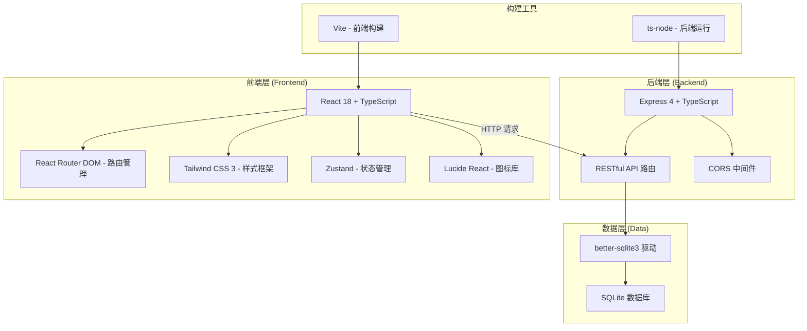
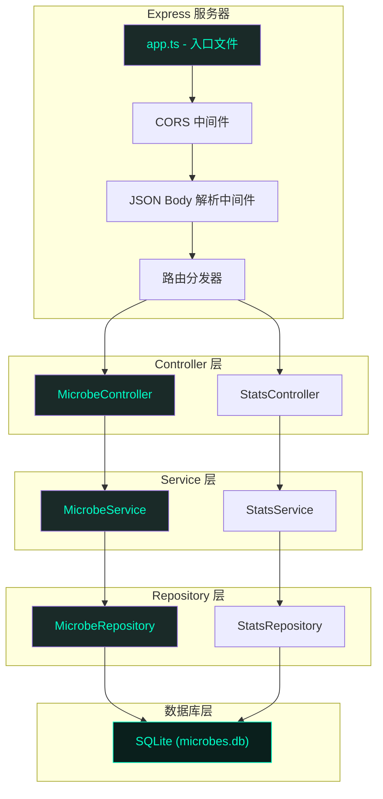
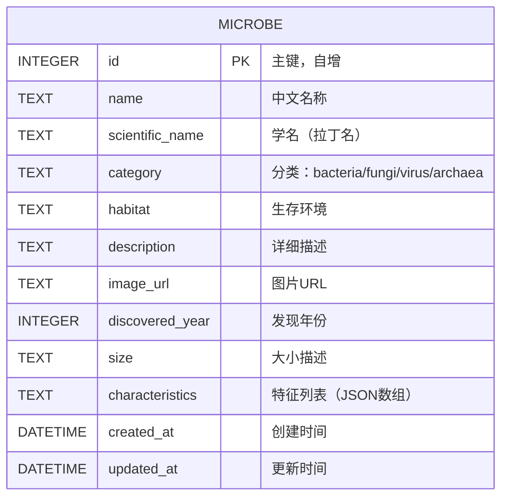

## 1. 架构设计



## 2. 技术描述

- **前端**：React@18 + TypeScript + Tailwind CSS@3 + Vite
- **状态管理**：Zustand（轻量级，适合中小规模应用）
- **路由**：React Router DOM@6
- **图标**：Lucide React
- **后端**：Express@4 + TypeScript
- **数据库**：SQLite（嵌入式，无需额外服务，便于开发和演示）
- **数据库驱动**：better-sqlite3（同步API，高性能）
- **初始化工具**：vite-init（react-express-ts 模板）

## 3. 路由定义

### 前端路由

| 路由路径 | 页面组件 | 用途 |
|----------|----------|------|
| `/` | HomePage | 首页大厅 - Hero区域、分类导航、精选标本 |
| `/category/:category` | CategoryPage | 分类展厅 - 按分类浏览微生物列表 |
| `/microbe/:id` | DetailPage | 标本详情页 - 微生物详细信息 |
| `*` | NotFoundPage | 404页面 |

### 后端API路由

| 方法 | 路径 | 用途 |
|------|------|------|
| GET | `/api/microbes` | 获取所有微生物列表（支持分类筛选、搜索、分页） |
| GET | `/api/microbes/:id` | 获取单个微生物详情 |
| GET | `/api/microbes/category/:category` | 按分类获取微生物列表 |
| GET | `/api/stats` | 获取统计数据（总数、各分类数量） |

## 4. API 定义

### 类型定义

```typescript
// 微生物分类
type MicrobeCategory = 'bacteria' | 'fungi' | 'virus' | 'archaea';

// 微生物实体
interface Microbe {
  id: number;
  name: string;
  scientificName: string;
  category: MicrobeCategory;
  habitat: string;
  description: string;
  imageUrl: string;
  discoveredYear: number;
  size: string;
  characteristics: string[];
}

// 统计数据
interface Stats {
  total: number;
  bacteria: number;
  fungi: number;
  virus: number;
  archaea: number;
}

// API 响应包装
interface ApiResponse<T> {
  success: boolean;
  data?: T;
  error?: string;
}
```

### 请求/响应示例

**GET /api/microbes**

Query 参数：
- `category` (可选): bacteria | fungi | virus | archaea
- `search` (可选): 搜索关键词
- `limit` (可选): 每页数量，默认20
- `offset` (可选): 偏移量，默认0

响应：
```json
{
  "success": true,
  "data": [
    {
      "id": 1,
      "name": "大肠杆菌",
      "scientificName": "Escherichia coli",
      "category": "bacteria",
      "habitat": "人体肠道、环境水体",
      "description": "大肠杆菌是革兰氏阴性杆菌...",
      "imageUrl": "https://...",
      "discoveredYear": 1885,
      "size": "约2μm长，0.5μm直径",
      "characteristics": ["革兰氏阴性", "兼性厌氧", "杆状"]
    }
  ]
}
```

**GET /api/microbes/:id**

响应：
```json
{
  "success": true,
  "data": {
    "id": 1,
    "name": "大肠杆菌",
    "scientificName": "Escherichia coli",
    "category": "bacteria",
    "habitat": "人体肠道、环境水体",
    "description": "大肠杆菌是革兰氏阴性杆菌，是肠道中最主要且数量最多的一种细菌，主要寄生于大肠内。约占肠道菌中的0.1%，周身鞭毛，能运动，无芽孢。",
    "imageUrl": "https://...",
    "discoveredYear": 1885,
    "size": "约2μm长，0.5μm直径",
    "characteristics": ["革兰氏阴性", "兼性厌氧", "杆状", "鞭毛运动"]
  }
}
```

**GET /api/stats**

响应：
```json
{
  "success": true,
  "data": {
    "total": 24,
    "bacteria": 8,
    "fungi": 6,
    "virus": 6,
    "archaea": 4
  }
}
```

## 5. 服务器架构图



## 6. 数据模型

### 6.1 数据模型定义（ER图）



### 6.2 DDL语句和初始数据

```sql
-- 创建微生物表
CREATE TABLE IF NOT EXISTS microbes (
    id INTEGER PRIMARY KEY AUTOINCREMENT,
    name TEXT NOT NULL,
    scientific_name TEXT NOT NULL,
    category TEXT NOT NULL CHECK(category IN ('bacteria', 'fungi', 'virus', 'archaea')),
    habitat TEXT NOT NULL,
    description TEXT NOT NULL,
    image_url TEXT NOT NULL,
    discovered_year INTEGER,
    size TEXT,
    characteristics TEXT DEFAULT '[]',
    created_at DATETIME DEFAULT CURRENT_TIMESTAMP,
    updated_at DATETIME DEFAULT CURRENT_TIMESTAMP
);

-- 创建索引
CREATE INDEX IF NOT EXISTS idx_microbes_category ON microbes(category);
CREATE INDEX IF NOT EXISTS idx_microbes_name ON microbes(name);

-- 初始数据示例（细菌）
INSERT INTO microbes (name, scientific_name, category, habitat, description, image_url, discovered_year, size, characteristics) VALUES
('大肠杆菌', 'Escherichia coli', 'bacteria', '人体肠道、环境水体', '大肠杆菌是革兰氏阴性杆菌，是肠道中最主要且数量最多的一种细菌，主要寄生于大肠内。约占肠道菌中的0.1%，周身鞭毛，能运动，无芽孢。大多数菌株是无害的，但某些血清型可引起严重的食物中毒。', 'https://trae-api-cn.mchost.guru/api/ide/v1/text_to_image?prompt=microscopic%20view%20of%20Escherichia%20coli%20bacteria%20glowing%20teal%20on%20dark%20background%20scientific%20illustration&image_size=square_hd', 1885, '约2μm长，0.5μm直径', '["革兰氏阴性","兼性厌氧","杆状","鞭毛运动"]');
```

## 7. 项目目录结构

```
/
├── .trae/
│   └── documents/              # 项目文档
├── api/                        # 后端源码
│   ├── src/
│   │   ├── controllers/        # 控制器层
│   │   ├── services/           # 服务层
│   │   ├── repositories/       # 数据访问层
│   │   ├── routes/             # 路由定义
│   │   ├── types/              # TypeScript类型
│   │   ├── database.ts         # 数据库连接
│   │   ├── seed.ts             # 种子数据初始化
│   │   └── app.ts              # Express应用入口
│   └── tsconfig.json
├── shared/                     # 前后端共享类型
│   └── types.ts
├── src/                        # 前端源码
│   ├── components/             # React组件
│   ├── pages/                  # 页面组件
│   ├── hooks/                  # 自定义Hooks
│   ├── store/                  # Zustand状态管理
│   ├── utils/                  # 工具函数
│   ├── types/                  # 前端类型
│   ├── App.tsx                 # 根组件
│   ├── main.tsx                # 入口文件
│   └── index.css               # 全局样式
├── public/                     # 静态资源
├── migrations/                 # 数据库迁移文件
├── package.json
├── tsconfig.json
├── vite.config.ts
├── tailwind.config.js
└── postcss.config.js
```
